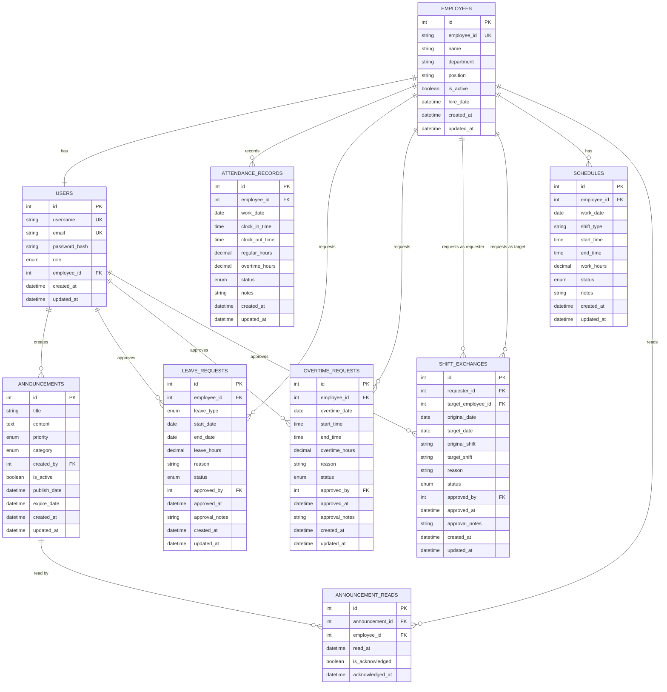

# 考勤管理系統數據庫設計文檔

## 文檔概述

本文檔詳細說明長富考勤系統中關於申請調班、請假、加班申請、公告訊息以及打卡考勤記錄等功能的數據庫設計、表結構、業務邏輯和API設計。

**更新日期**: 2025年9月5日  
**版本**: 2.0  
**適用範圍**: 長富考勤管理系統  
**技術棧**: Prisma ORM + SQLite/PostgreSQL  

---

## 🎯 功能模組總覽

### 核心功能模組

1. **考勤打卡系統**
   - 上下班打卡記錄
   - 異常考勤處理
   - 工時統計計算

2. **請假申請系統**
   - 各類請假申請
   - 請假審核流程
   - 請假時數統計

3. **加班申請系統**
   - 加班申請管理
   - 加班審核流程
   - 加班費計算

4. **調班申請系統**
   - 班次調換申請
   - 調班審核管理
   - 排班衝突檢查

5. **公告訊息系統**
   - 系統公告發布
   - 員工公告閱讀
   - 公告分類管理

6. **薪資管理系統**
   - 月薪資計算與記錄
   - 健保、勞保扣除計算
   - 薪資條生成與管理

7. **獎金管理系統**
   - 年終獎金計算發放
   - 三節獎金管理
   - 績效獎金處理

8. **按比例獎金系統** ⭐ **新功能**
   - 到職未滿一年員工獎金按比例計算
   - 自動服務月數計算
   - 智慧型獎金發放邏輯

9. **補充保費計算系統** ⭐ **新功能**
   - 獎金補充保費自動計算
   - 年度累計追蹤管理
   - 多種收入類型支援

---

## 📊 數據庫架構設計

### 整體ER關係圖



---

## 🏢 核心數據表設計

### 1. 員工基本資料表 (employees)

```sql
CREATE TABLE employees (
  id INTEGER PRIMARY KEY AUTOINCREMENT,
  employee_id TEXT UNIQUE NOT NULL,           -- 員工編號
  name TEXT NOT NULL,                         -- 姓名
  department TEXT,                            -- 部門
  position TEXT,                              -- 職位
  phone TEXT,                                 -- 電話
  email TEXT,                                 -- 電子郵件
  hire_date DATETIME NOT NULL,                -- 到職日期
  is_active BOOLEAN DEFAULT 1,                -- 是否在職
  manager_id INTEGER,                         -- 主管ID
  base_salary REAL,                           -- 基本薪資
  hourly_rate REAL,                           -- 時薪
  
  -- 考勤相關設定
  default_shift TEXT DEFAULT 'regular',       -- 預設班別
  work_hours_per_day REAL DEFAULT 8.0,       -- 每日標準工時
  
  created_at DATETIME DEFAULT CURRENT_TIMESTAMP,
  updated_at DATETIME DEFAULT CURRENT_TIMESTAMP,
  
  FOREIGN KEY (manager_id) REFERENCES employees(id),
  CHECK (base_salary >= 0),
  CHECK (hourly_rate >= 0),
  CHECK (work_hours_per_day > 0 AND work_hours_per_day <= 24)
);

-- 索引設計
CREATE INDEX idx_employees_employee_id ON employees(employee_id);
CREATE INDEX idx_employees_department ON employees(department);
CREATE INDEX idx_employees_is_active ON employees(is_active);
CREATE INDEX idx_employees_manager ON employees(manager_id);
```

### 2. 考勤打卡記錄表 (attendance_records)

```sql
CREATE TABLE attendance_records (
  id INTEGER PRIMARY KEY AUTOINCREMENT,
  employee_id INTEGER NOT NULL,
  work_date DATE NOT NULL,                    -- 工作日期
  
  -- 打卡時間
  clock_in_time DATETIME,                     -- 上班打卡時間
  clock_out_time DATETIME,                    -- 下班打卡時間
  
  -- 實際工時
  regular_hours REAL DEFAULT 0,              -- 正常工時
  overtime_hours REAL DEFAULT 0,             -- 加班時數
  break_hours REAL DEFAULT 0,                -- 休息時數
  total_hours REAL DEFAULT 0,                -- 總工時
  
  -- 排班資訊
  scheduled_start DATETIME,                  -- 排班開始時間
  scheduled_end DATETIME,                    -- 排班結束時間
  shift_type TEXT DEFAULT 'regular',         -- 班別類型
  
  -- 狀態管理
  status TEXT DEFAULT 'normal',              -- 狀態: normal, late, early_leave, absent, holiday
  is_holiday BOOLEAN DEFAULT 0,             -- 是否為假日
  is_overtime BOOLEAN DEFAULT 0,            -- 是否有加班
  
  -- 異常處理
  late_minutes INTEGER DEFAULT 0,           -- 遲到分鐘數
  early_leave_minutes INTEGER DEFAULT 0,    -- 早退分鐘數
  
  -- 備註資訊
  notes TEXT,                                -- 備註
  created_by INTEGER,                        -- 記錄建立者
  updated_by INTEGER,                        -- 記錄更新者
  
  created_at DATETIME DEFAULT CURRENT_TIMESTAMP,
  updated_at DATETIME DEFAULT CURRENT_TIMESTAMP,
  
  FOREIGN KEY (employee_id) REFERENCES employees(id) ON DELETE CASCADE,
  FOREIGN KEY (created_by) REFERENCES users(id),
  FOREIGN KEY (updated_by) REFERENCES users(id),
  
  UNIQUE(employee_id, work_date),
  CHECK (regular_hours >= 0),
  CHECK (overtime_hours >= 0),
  CHECK (total_hours >= 0),
  CHECK (late_minutes >= 0),
  CHECK (early_leave_minutes >= 0)
);

-- 索引設計
CREATE INDEX idx_attendance_employee_date ON attendance_records(employee_id, work_date);
CREATE INDEX idx_attendance_work_date ON attendance_records(work_date);
CREATE INDEX idx_attendance_status ON attendance_records(status);
CREATE INDEX idx_attendance_overtime ON attendance_records(is_overtime);
```

### 3. 請假申請表 (leave_requests)

```sql
CREATE TABLE leave_requests (
  id INTEGER PRIMARY KEY AUTOINCREMENT,
  employee_id INTEGER NOT NULL,
  
  -- 請假基本資訊
  leave_type TEXT NOT NULL,                  -- 請假類型: annual, sick, personal, maternity, paternity, funeral, marriage
  start_date DATE NOT NULL,                  -- 請假開始日期
  end_date DATE NOT NULL,                    -- 請假結束日期
  start_time TIME,                           -- 開始時間 (半日假用)
  end_time TIME,                             -- 結束時間 (半日假用)
  
  -- 請假時數計算
  leave_days REAL NOT NULL,                  -- 請假天數
  leave_hours REAL NOT NULL,                 -- 請假時數
  is_half_day BOOLEAN DEFAULT 0,            -- 是否為半日假
  
  -- 申請資訊
  reason TEXT NOT NULL,                      -- 請假原因
  emergency_contact TEXT,                    -- 緊急聯絡人
  substitute_employee_id INTEGER,           -- 代理人ID
  
  -- 審核流程
  status TEXT DEFAULT 'pending',            -- 狀態: pending, approved, rejected, cancelled
  priority INTEGER DEFAULT 1,               -- 優先級: 1-一般, 2-緊急, 3-特急
  
  -- 審核記錄
  approved_by INTEGER,                       -- 審核者ID
  approved_at DATETIME,                      -- 審核時間
  approval_notes TEXT,                       -- 審核備註
  
  -- 附件資訊
  attachment_path TEXT,                      -- 附件路径
  medical_certificate BOOLEAN DEFAULT 0,    -- 是否有醫療證明
  
  -- 系統記錄
  submitted_at DATETIME DEFAULT CURRENT_TIMESTAMP,
  created_at DATETIME DEFAULT CURRENT_TIMESTAMP,
  updated_at DATETIME DEFAULT CURRENT_TIMESTAMP,
  
  FOREIGN KEY (employee_id) REFERENCES employees(id) ON DELETE CASCADE,
  FOREIGN KEY (substitute_employee_id) REFERENCES employees(id),
  FOREIGN KEY (approved_by) REFERENCES users(id),
  
  CHECK (start_date <= end_date),
  CHECK (leave_days > 0),
  CHECK (leave_hours > 0),
  CHECK (priority IN (1, 2, 3)),
  CHECK (status IN ('pending', 'approved', 'rejected', 'cancelled'))
);

-- 索引設計
CREATE INDEX idx_leave_employee ON leave_requests(employee_id);
CREATE INDEX idx_leave_date_range ON leave_requests(start_date, end_date);
CREATE INDEX idx_leave_status ON leave_requests(status);
CREATE INDEX idx_leave_type ON leave_requests(leave_type);
CREATE INDEX idx_leave_submitted ON leave_requests(submitted_at);
```

### 4. 加班申請表 (overtime_requests)

```sql
CREATE TABLE overtime_requests (
  id INTEGER PRIMARY KEY AUTOINCREMENT,
  employee_id INTEGER NOT NULL,
  
  -- 加班基本資訊
  overtime_date DATE NOT NULL,               -- 加班日期
  start_time DATETIME NOT NULL,             -- 加班開始時間
  end_time DATETIME NOT NULL,               -- 加班結束時間
  
  -- 加班時數計算
  overtime_hours REAL NOT NULL,             -- 加班時數
  overtime_rate REAL DEFAULT 1.34,          -- 加班費率 (平日1.34倍)
  is_weekend BOOLEAN DEFAULT 0,             -- 是否為週末加班
  is_holiday BOOLEAN DEFAULT 0,             -- 是否為假日加班
  
  -- 加班類型和原因
  overtime_type TEXT DEFAULT 'regular',     -- 加班類型: regular, weekend, holiday, urgent
  reason TEXT NOT NULL,                      -- 加班原因
  project_code TEXT,                         -- 專案代碼
  task_description TEXT,                     -- 工作內容描述
  
  -- 申請資訊
  is_compensatory BOOLEAN DEFAULT 0,        -- 是否申請補休
  meal_allowance BOOLEAN DEFAULT 0,         -- 是否申請餐費補助
  transportation_allowance BOOLEAN DEFAULT 0, -- 是否申請交通補助
  
  -- 審核流程
  status TEXT DEFAULT 'pending',            -- 狀態: pending, approved, rejected, cancelled
  priority INTEGER DEFAULT 1,               -- 優先級
  
  -- 審核記錄
  approved_by INTEGER,                       -- 審核者ID
  approved_at DATETIME,                      -- 審核時間
  approval_notes TEXT,                       -- 審核備註
  
  -- 實際執行記錄
  actual_start_time DATETIME,               -- 實際開始時間
  actual_end_time DATETIME,                 -- 實際結束時間
  actual_hours REAL,                        -- 實際加班時數
  completion_notes TEXT,                    -- 完成情況備註
  
  -- 系統記錄
  submitted_at DATETIME DEFAULT CURRENT_TIMESTAMP,
  created_at DATETIME DEFAULT CURRENT_TIMESTAMP,
  updated_at DATETIME DEFAULT CURRENT_TIMESTAMP,
  
  FOREIGN KEY (employee_id) REFERENCES employees(id) ON DELETE CASCADE,
  FOREIGN KEY (approved_by) REFERENCES users(id),
  
  CHECK (start_time < end_time),
  CHECK (overtime_hours > 0),
  CHECK (overtime_rate > 0),
  CHECK (status IN ('pending', 'approved', 'rejected', 'cancelled')),
  CHECK (priority IN (1, 2, 3))
);

-- 索引設計
CREATE INDEX idx_overtime_employee ON overtime_requests(employee_id);
CREATE INDEX idx_overtime_date ON overtime_requests(overtime_date);
CREATE INDEX idx_overtime_status ON overtime_requests(status);
CREATE INDEX idx_overtime_type ON overtime_requests(overtime_type);
CREATE INDEX idx_overtime_submitted ON overtime_requests(submitted_at);
```

### 5. 調班申請表 (shift_exchanges)

```sql
CREATE TABLE shift_exchanges (
  id INTEGER PRIMARY KEY AUTOINCREMENT,
  
  -- 申請人資訊
  requester_id INTEGER NOT NULL,            -- 申請人ID
  target_employee_id INTEGER,               -- 對方員工ID (可為空，表示找人代班)
  
  -- 原班次資訊
  original_date DATE NOT NULL,              -- 原班次日期
  original_shift TEXT NOT NULL,             -- 原班次類型
  original_start_time DATETIME,             -- 原班次開始時間
  original_end_time DATETIME,               -- 原班次結束時間
  
  -- 目標班次資訊 (互換用)
  target_date DATE,                         -- 目標班次日期
  target_shift TEXT,                        -- 目標班次類型
  target_start_time DATETIME,              -- 目標班次開始時間
  target_end_time DATETIME,                -- 目標班次結束時間
  
  -- 申請資訊
  exchange_type TEXT DEFAULT 'swap',       -- 調班類型: swap(互換), substitute(代班), coverage(找人代班)
  reason TEXT NOT NULL,                     -- 調班原因
  is_emergency BOOLEAN DEFAULT 0,          -- 是否為緊急調班
  
  -- 工時影響分析
  hours_difference REAL DEFAULT 0,         -- 工時差異
  pay_difference REAL DEFAULT 0,           -- 薪資差異
  requires_overtime BOOLEAN DEFAULT 0,     -- 是否產生加班
  
  -- 審核流程
  status TEXT DEFAULT 'pending',           -- 狀態: pending, approved, rejected, cancelled, completed
  priority INTEGER DEFAULT 1,              -- 優先級
  
  -- 相關人員確認
  target_confirmed BOOLEAN DEFAULT 0,      -- 對方確認狀態
  target_confirmed_at DATETIME,            -- 對方確認時間
  
  -- 審核記錄
  approved_by INTEGER,                      -- 審核者ID
  approved_at DATETIME,                     -- 審核時間
  approval_notes TEXT,                      -- 審核備註
  
  -- 執行記錄
  executed_at DATETIME,                     -- 執行時間
  execution_notes TEXT,                     -- 執行備註
  
  -- 系統記錄
  submitted_at DATETIME DEFAULT CURRENT_TIMESTAMP,
  created_at DATETIME DEFAULT CURRENT_TIMESTAMP,
  updated_at DATETIME DEFAULT CURRENT_TIMESTAMP,
  
  FOREIGN KEY (requester_id) REFERENCES employees(id) ON DELETE CASCADE,
  FOREIGN KEY (target_employee_id) REFERENCES employees(id),
  FOREIGN KEY (approved_by) REFERENCES users(id),
  
  CHECK (exchange_type IN ('swap', 'substitute', 'coverage')),
  CHECK (status IN ('pending', 'approved', 'rejected', 'cancelled', 'completed')),
  CHECK (priority IN (1, 2, 3))
);

-- 索引設計
CREATE INDEX idx_shift_exchange_requester ON shift_exchanges(requester_id);
CREATE INDEX idx_shift_exchange_target ON shift_exchanges(target_employee_id);
CREATE INDEX idx_shift_exchange_date ON shift_exchanges(original_date);
CREATE INDEX idx_shift_exchange_status ON shift_exchanges(status);
CREATE INDEX idx_shift_exchange_type ON shift_exchanges(exchange_type);
```

### 6. 公告訊息表 (announcements)

```sql
CREATE TABLE announcements (
  id INTEGER PRIMARY KEY AUTOINCREMENT,
  
  -- 公告基本資訊
  title TEXT NOT NULL,                      -- 公告標題
  content TEXT NOT NULL,                    -- 公告內容
  summary TEXT,                             -- 公告摘要
  
  -- 分類和優先級
  category TEXT DEFAULT 'general',         -- 分類: general, policy, system, emergency, hr, event
  priority TEXT DEFAULT 'normal',          -- 優先級: low, normal, high, urgent
  type TEXT DEFAULT 'info',                -- 類型: info, warning, success, error
  
  -- 發布控制
  is_active BOOLEAN DEFAULT 1,             -- 是否啟用
  is_draft BOOLEAN DEFAULT 0,              -- 是否為草稿
  is_pinned BOOLEAN DEFAULT 0,             -- 是否置頂
  
  -- 時間控制
  publish_date DATETIME DEFAULT CURRENT_TIMESTAMP, -- 發布時間
  expire_date DATETIME,                     -- 過期時間
  effective_start DATETIME,                -- 生效開始時間
  effective_end DATETIME,                  -- 生效結束時間
  
  -- 目標對象
  target_departments TEXT,                  -- 目標部門 (JSON格式)
  target_positions TEXT,                   -- 目標職位 (JSON格式)
  target_employees TEXT,                   -- 目標員工 (JSON格式)
  is_all_employees BOOLEAN DEFAULT 1,     -- 是否針對所有員工
  
  -- 互動控制
  allow_comments BOOLEAN DEFAULT 0,        -- 是否允許評論
  require_acknowledgment BOOLEAN DEFAULT 0, -- 是否需要確認已讀
  attachment_path TEXT,                     -- 附件路径
  
  -- 統計資訊
  view_count INTEGER DEFAULT 0,            -- 查看次數
  acknowledgment_count INTEGER DEFAULT 0,  -- 確認已讀人數
  
  -- 作者資訊
  created_by INTEGER NOT NULL,             -- 建立者ID
  updated_by INTEGER,                       -- 最後更新者ID
  
  created_at DATETIME DEFAULT CURRENT_TIMESTAMP,
  updated_at DATETIME DEFAULT CURRENT_TIMESTAMP,
  
  FOREIGN KEY (created_by) REFERENCES users(id),
  FOREIGN KEY (updated_by) REFERENCES users(id),
  
  CHECK (category IN ('general', 'policy', 'system', 'emergency', 'hr', 'event')),
  CHECK (priority IN ('low', 'normal', 'high', 'urgent')),
  CHECK (type IN ('info', 'warning', 'success', 'error'))
);

-- 索引設計
CREATE INDEX idx_announcements_active ON announcements(is_active);
CREATE INDEX idx_announcements_category ON announcements(category);
CREATE INDEX idx_announcements_priority ON announcements(priority);
CREATE INDEX idx_announcements_publish_date ON announcements(publish_date);
CREATE INDEX idx_announcements_expire_date ON announcements(expire_date);
CREATE INDEX idx_announcements_pinned ON announcements(is_pinned);
```

### 7. 公告閱讀記錄表 (announcement_reads)

```sql
CREATE TABLE announcement_reads (
  id INTEGER PRIMARY KEY AUTOINCREMENT,
  announcement_id INTEGER NOT NULL,         -- 公告ID
  employee_id INTEGER NOT NULL,             -- 員工ID
  
  -- 閱讀記錄
  read_at DATETIME DEFAULT CURRENT_TIMESTAMP, -- 閱讀時間
  read_count INTEGER DEFAULT 1,             -- 閱讀次數
  last_read_at DATETIME DEFAULT CURRENT_TIMESTAMP, -- 最後閱讀時間
  
  -- 確認狀態
  is_acknowledged BOOLEAN DEFAULT 0,        -- 是否已確認
  acknowledged_at DATETIME,                 -- 確認時間
  acknowledgment_notes TEXT,                -- 確認備註
  
  -- 互動記錄
  is_bookmarked BOOLEAN DEFAULT 0,         -- 是否收藏
  rating INTEGER,                           -- 評分 (1-5)
  feedback TEXT,                            -- 反饋意見
  
  created_at DATETIME DEFAULT CURRENT_TIMESTAMP,
  updated_at DATETIME DEFAULT CURRENT_TIMESTAMP,
  
  FOREIGN KEY (announcement_id) REFERENCES announcements(id) ON DELETE CASCADE,
  FOREIGN KEY (employee_id) REFERENCES employees(id) ON DELETE CASCADE,
  
  UNIQUE(announcement_id, employee_id),
  CHECK (read_count > 0),
  CHECK (rating >= 1 AND rating <= 5)
);

-- 索引設計
CREATE INDEX idx_announcement_reads_announcement ON announcement_reads(announcement_id);
CREATE INDEX idx_announcement_reads_employee ON announcement_reads(employee_id);
CREATE INDEX idx_announcement_reads_acknowledged ON announcement_reads(is_acknowledged);
CREATE INDEX idx_announcement_reads_read_at ON announcement_reads(read_at);
```

### 8. 排班表 (schedules)

```sql
CREATE TABLE schedules (
  id INTEGER PRIMARY KEY AUTOINCREMENT,
  employee_id INTEGER NOT NULL,
  
  -- 排班基本資訊
  work_date DATE NOT NULL,                  -- 工作日期
  shift_type TEXT NOT NULL,                -- 班別類型: morning, afternoon, night, split, flexible
  
  -- 時間安排
  start_time DATETIME NOT NULL,            -- 開始時間
  end_time DATETIME NOT NULL,              -- 結束時間
  break_start_time DATETIME,               -- 休息開始時間
  break_end_time DATETIME,                 -- 休息結束時間
  
  -- 工時計算
  scheduled_hours REAL NOT NULL,           -- 排班工時
  break_hours REAL DEFAULT 0,             -- 休息時數
  net_work_hours REAL NOT NULL,           -- 淨工作時數
  
  -- 排班狀態
  status TEXT DEFAULT 'scheduled',         -- 狀態: scheduled, confirmed, modified, cancelled
  is_holiday BOOLEAN DEFAULT 0,           -- 是否為假日班
  is_overtime_shift BOOLEAN DEFAULT 0,    -- 是否為加班班次
  
  -- 地點和部門
  work_location TEXT,                      -- 工作地點
  department_override TEXT,                -- 部門覆寫 (臨時調派用)
  
  -- 備註資訊
  notes TEXT,                              -- 排班備註
  special_requirements TEXT,               -- 特殊要求
  
  -- 創建和修改記錄
  created_by INTEGER,                      -- 建立者ID
  updated_by INTEGER,                      -- 更新者ID
  approved_by INTEGER,                     -- 審核者ID
  approved_at DATETIME,                    -- 審核時間
  
  created_at DATETIME DEFAULT CURRENT_TIMESTAMP,
  updated_at DATETIME DEFAULT CURRENT_TIMESTAMP,
  
  FOREIGN KEY (employee_id) REFERENCES employees(id) ON DELETE CASCADE,
  FOREIGN KEY (created_by) REFERENCES users(id),
  FOREIGN KEY (updated_by) REFERENCES users(id),
  FOREIGN KEY (approved_by) REFERENCES users(id),
  
  UNIQUE(employee_id, work_date),
  CHECK (start_time < end_time),
  CHECK (scheduled_hours > 0),
  CHECK (break_hours >= 0),
  CHECK (net_work_hours > 0),
  CHECK (status IN ('scheduled', 'confirmed', 'modified', 'cancelled'))
);

-- 索引設計
CREATE INDEX idx_schedules_employee_date ON schedules(employee_id, work_date);
CREATE INDEX idx_schedules_work_date ON schedules(work_date);
CREATE INDEX idx_schedules_shift_type ON schedules(shift_type);
CREATE INDEX idx_schedules_status ON schedules(status);
```

---

## 🔧 業務邏輯設計

### 考勤打卡邏輯

#### 1. 上班打卡流程

```typescript
interface ClockInRequest {
  employeeId: number;
  clockInTime: Date;
  location?: string;
  deviceId?: string;
  notes?: string;
}

async function processClockIn(request: ClockInRequest): Promise<AttendanceRecord> {
  // 1. 驗證員工是否存在且在職
  const employee = await validateEmployee(request.employeeId);
  
  // 2. 檢查是否已經打過上班卡
  const existingRecord = await findTodayAttendance(request.employeeId);
  if (existingRecord?.clockInTime) {
    throw new Error('今日已完成上班打卡');
  }
  
  // 3. 取得員工排班資訊
  const schedule = await getEmployeeSchedule(request.employeeId, new Date());
  
  // 4. 計算遲到情況
  const lateMinutes = calculateLateMinutes(request.clockInTime, schedule?.startTime);
  
  // 5. 建立或更新考勤記錄
  const attendanceRecord = await createOrUpdateAttendance({
    employeeId: request.employeeId,
    workDate: startOfDay(request.clockInTime),
    clockInTime: request.clockInTime,
    scheduledStart: schedule?.startTime,
    shiftType: schedule?.shiftType || 'regular',
    lateMinutes,
    status: lateMinutes > 0 ? 'late' : 'normal',
    notes: request.notes
  });
  
  // 6. 記錄打卡日誌
  await logClockInEvent(request);
  
  return attendanceRecord;
}
```

#### 2. 下班打卡流程

```typescript
interface ClockOutRequest {
  employeeId: number;
  clockOutTime: Date;
  location?: string;
  deviceId?: string;
  notes?: string;
}

async function processClockOut(request: ClockOutRequest): Promise<AttendanceRecord> {
  // 1. 取得今日考勤記錄
  const attendanceRecord = await findTodayAttendance(request.employeeId);
  if (!attendanceRecord?.clockInTime) {
    throw new Error('尚未完成上班打卡');
  }
  
  // 2. 取得排班資訊
  const schedule = await getEmployeeSchedule(request.employeeId, new Date());
  
  // 3. 計算工時
  const workHours = calculateWorkHours(
    attendanceRecord.clockInTime,
    request.clockOutTime,
    schedule?.breakHours || 1
  );
  
  // 4. 計算早退情況
  const earlyLeaveMinutes = calculateEarlyLeaveMinutes(
    request.clockOutTime,
    schedule?.endTime
  );
  
  // 5. 計算加班時數
  const overtimeHours = calculateOvertimeHours(
    workHours.regularHours,
    schedule?.scheduledHours || 8
  );
  
  // 6. 更新考勤記錄
  const updatedRecord = await updateAttendanceRecord(attendanceRecord.id, {
    clockOutTime: request.clockOutTime,
    regularHours: workHours.regularHours,
    overtimeHours: overtimeHours,
    totalHours: workHours.totalHours,
    earlyLeaveMinutes,
    status: determineAttendanceStatus(attendanceRecord, earlyLeaveMinutes, overtimeHours),
    notes: combineNotes(attendanceRecord.notes, request.notes)
  });
  
  // 7. 如有加班，建議建立加班申請
  if (overtimeHours > 0.5) {
    await suggestOvertimeRequest(request.employeeId, attendanceRecord.workDate, overtimeHours);
  }
  
  return updatedRecord;
}
```

### 請假申請邏輯

#### 請假申請處理流程

```typescript
interface LeaveRequestData {
  employeeId: number;
  leaveType: 'annual' | 'sick' | 'personal' | 'maternity' | 'paternity';
  startDate: Date;
  endDate: Date;
  startTime?: Date;
  endTime?: Date;
  reason: string;
  isHalfDay: boolean;
  substituteEmployeeId?: number;
  attachmentPath?: string;
}

async function processLeaveRequest(data: LeaveRequestData): Promise<LeaveRequest> {
  // 1. 驗證請假資格
  await validateLeaveEligibility(data);
  
  // 2. 計算請假天數和時數
  const leaveCalculation = calculateLeaveDaysAndHours(
    data.startDate,
    data.endDate,
    data.startTime,
    data.endTime,
    data.isHalfDay
  );
  
  // 3. 檢查請假額度
  await checkLeaveQuota(data.employeeId, data.leaveType, leaveCalculation.days);
  
  // 4. 檢查排班衝突
  await checkScheduleConflicts(data.employeeId, data.startDate, data.endDate);
  
  // 5. 建立請假申請
  const leaveRequest = await createLeaveRequest({
    ...data,
    leaveDays: leaveCalculation.days,
    leaveHours: leaveCalculation.hours,
    status: 'pending',
    submittedAt: new Date()
  });
  
  // 6. 發送審核通知
  await sendApprovalNotification(leaveRequest);
  
  // 7. 如有代理人，發送通知
  if (data.substituteEmployeeId) {
    await sendSubstituteNotification(leaveRequest);
  }
  
  return leaveRequest;
}
```

### 加班申請邏輯

#### 加班申請處理流程

```typescript
interface OvertimeRequestData {
  employeeId: number;
  overtimeDate: Date;
  startTime: Date;
  endTime: Date;
  reason: string;
  projectCode?: string;
  taskDescription?: string;
  isCompensatory: boolean;
  mealAllowance: boolean;
  transportationAllowance: boolean;
}

async function processOvertimeRequest(data: OvertimeRequestData): Promise<OvertimeRequest> {
  // 1. 驗證加班資格
  await validateOvertimeEligibility(data);
  
  // 2. 計算加班時數和費率
  const overtimeCalculation = calculateOvertimeDetails(
    data.startTime,
    data.endTime,
    data.overtimeDate
  );
  
  // 3. 檢查勞基法限制
  await checkLaborLawLimits(data.employeeId, data.overtimeDate, overtimeCalculation.hours);
  
  // 4. 檢查排班和衝突
  await checkOvertimeScheduleConflicts(data.employeeId, data.overtimeDate, data.startTime, data.endTime);
  
  // 5. 建立加班申請
  const overtimeRequest = await createOvertimeRequest({
    ...data,
    overtimeHours: overtimeCalculation.hours,
    overtimeRate: overtimeCalculation.rate,
    isWeekend: overtimeCalculation.isWeekend,
    isHoliday: overtimeCalculation.isHoliday,
    overtimeType: determineOvertimeType(data.overtimeDate, data.startTime),
    status: 'pending',
    submittedAt: new Date()
  });
  
  // 6. 發送審核通知
  await sendOvertimeApprovalNotification(overtimeRequest);
  
  return overtimeRequest;
}
```

### 調班申請邏輯

#### 調班申請處理流程

```typescript
interface ShiftExchangeData {
  requesterId: number;
  targetEmployeeId?: number;
  originalDate: Date;
  originalShift: string;
  targetDate?: Date;
  targetShift?: string;
  exchangeType: 'swap' | 'substitute' | 'coverage';
  reason: string;
  isEmergency: boolean;
}

async function processShiftExchange(data: ShiftExchangeData): Promise<ShiftExchange> {
  // 1. 驗證調班資格
  await validateShiftExchangeEligibility(data);
  
  // 2. 取得原班次資訊
  const originalSchedule = await getSchedule(data.requesterId, data.originalDate);
  if (!originalSchedule) {
    throw new Error('找不到原班次資訊');
  }
  
  // 3. 檢查目標員工是否可用 (如有指定)
  if (data.targetEmployeeId) {
    await validateTargetEmployeeAvailability(data.targetEmployeeId, data.originalDate);
    
    // 互換班次的情況
    if (data.exchangeType === 'swap' && data.targetDate) {
      await validateRequesterAvailability(data.requesterId, data.targetDate);
    }
  }
  
  // 4. 計算工時和薪資影響
  const impactAnalysis = await calculateShiftExchangeImpact(data, originalSchedule);
  
  // 5. 建立調班申請
  const shiftExchange = await createShiftExchange({
    ...data,
    originalStartTime: originalSchedule.startTime,
    originalEndTime: originalSchedule.endTime,
    hoursDifference: impactAnalysis.hoursDifference,
    payDifference: impactAnalysis.payDifference,
    requiresOvertime: impactAnalysis.requiresOvertime,
    status: 'pending',
    submittedAt: new Date()
  });
  
  // 6. 發送相關通知
  await sendShiftExchangeNotifications(shiftExchange);
  
  return shiftExchange;
}
```

---

## 🚀 API設計規範

### 考勤管理API

#### 1. 打卡相關API

```typescript
// POST /api/attendance/clock-in
// 上班打卡
interface ClockInRequest {
  location?: string;
  deviceId?: string;
  notes?: string;
}

// POST /api/attendance/clock-out
// 下班打卡
interface ClockOutRequest {
  location?: string;
  deviceId?: string;
  notes?: string;
}

// GET /api/attendance/records
// 取得考勤記錄
interface GetAttendanceRecordsQuery {
  startDate?: string;
  endDate?: string;
  employeeId?: number;
  status?: string;
  page?: number;
  pageSize?: number;
}

// GET /api/attendance/summary
// 取得考勤統計
interface AttendanceSummaryQuery {
  employeeId?: number;
  year?: number;
  month?: number;
}
```

#### 2. 考勤記錄管理API

```typescript
// PUT /api/attendance/records/:id
// 修正考勤記錄 (管理員)
interface UpdateAttendanceRequest {
  clockInTime?: Date;
  clockOutTime?: Date;
  regularHours?: number;
  overtimeHours?: number;
  status?: string;
  notes?: string;
  correctionReason: string; // 修正原因
}

// POST /api/attendance/manual-entry
// 手動新增考勤記錄
interface ManualEntryRequest {
  employeeId: number;
  workDate: Date;
  clockInTime: Date;
  clockOutTime: Date;
  reason: string;
  approvedBy: number;
}
```

### 請假管理API

#### 1. 請假申請API

```typescript
// POST /api/leave-requests
// 提交請假申請
interface CreateLeaveRequestBody {
  leaveType: string;
  startDate: Date;
  endDate: Date;
  startTime?: Date;
  endTime?: Date;
  reason: string;
  isHalfDay: boolean;
  substituteEmployeeId?: number;
  emergencyContact?: string;
}

// GET /api/leave-requests
// 取得請假申請列表
interface GetLeaveRequestsQuery {
  status?: string;
  leaveType?: string;
  employeeId?: number;
  startDate?: string;
  endDate?: string;
  page?: number;
  pageSize?: number;
}

// PUT /api/leave-requests/:id/approve
// 審核請假申請
interface ApproveLeaveRequestBody {
  action: 'approve' | 'reject';
  notes?: string;
}
```

#### 2. 請假餘額API

```typescript
// GET /api/leave-requests/balance
// 取得請假餘額
interface LeaveBalanceResponse {
  employeeId: number;
  balances: {
    annual: { total: number; used: number; remaining: number };
    sick: { total: number; used: number; remaining: number };
    personal: { total: number; used: number; remaining: number };
  };
  year: number;
}
```

### 加班管理API

#### 1. 加班申請API

```typescript
// POST /api/overtime-requests
// 提交加班申請
interface CreateOvertimeRequestBody {
  overtimeDate: Date;
  startTime: Date;
  endTime: Date;
  reason: string;
  projectCode?: string;
  taskDescription?: string;
  isCompensatory: boolean;
  mealAllowance: boolean;
  transportationAllowance: boolean;
}

// GET /api/overtime-requests
// 取得加班申請列表
interface GetOvertimeRequestsQuery {
  status?: string;
  employeeId?: number;
  startDate?: string;
  endDate?: string;
  projectCode?: string;
  page?: number;
  pageSize?: number;
}

// PUT /api/overtime-requests/:id/complete
// 完成加班記錄
interface CompleteOvertimeBody {
  actualStartTime: Date;
  actualEndTime: Date;
  completionNotes?: string;
}
```

### 調班管理API

#### 1. 調班申請API

```typescript
// POST /api/shift-exchanges
// 提交調班申請
interface CreateShiftExchangeBody {
  targetEmployeeId?: number;
  originalDate: Date;
  originalShift: string;
  targetDate?: Date;
  targetShift?: string;
  exchangeType: 'swap' | 'substitute' | 'coverage';
  reason: string;
  isEmergency: boolean;
}

// PUT /api/shift-exchanges/:id/confirm
// 目標員工確認調班
interface ConfirmShiftExchangeBody {
  action: 'accept' | 'decline';
  notes?: string;
}

// GET /api/shift-exchanges/available-employees
// 取得可調班員工列表
interface GetAvailableEmployeesQuery {
  date: string;
  shift: string;
  skills?: string[];
}
```

### 公告管理API

#### 1. 公告CRUD API

```typescript
// POST /api/announcements
// 建立公告
interface CreateAnnouncementBody {
  title: string;
  content: string;
  summary?: string;
  category: string;
  priority: string;
  type: string;
  publishDate?: Date;
  expireDate?: Date;
  targetDepartments?: string[];
  targetPositions?: string[];
  targetEmployees?: number[];
  isAllEmployees: boolean;
  requireAcknowledgment: boolean;
  allowComments: boolean;
}

// GET /api/announcements
// 取得公告列表
interface GetAnnouncementsQuery {
  category?: string;
  priority?: string;
  status?: 'active' | 'expired' | 'draft';
  page?: number;
  pageSize?: number;
  forEmployee?: number; // 針對特定員工的公告
}

// PUT /api/announcements/:id/read
// 標記公告為已讀
interface MarkAnnouncementReadBody {
  isAcknowledged?: boolean;
  acknowledgmentNotes?: string;
  rating?: number;
  feedback?: string;
}
```

---

## 📊 統計報表功能

### 考勤統計報表

#### 1. 員工考勤統計

```typescript
interface AttendanceStatistics {
  employeeId: number;
  employeeName: string;
  department: string;
  period: { startDate: Date; endDate: Date };
  
  // 出勤統計
  totalWorkDays: number;
  actualWorkDays: number;
  absentDays: number;
  lateDays: number;
  earlyLeaveDays: number;
  
  // 工時統計
  totalWorkHours: number;
  regularHours: number;
  overtimeHours: number;
  averageWorkHours: number;
  
  // 遲到早退統計
  totalLateMinutes: number;
  averageLateMinutes: number;
  totalEarlyLeaveMinutes: number;
  
  // 出勤率
  attendanceRate: number;
  punctualityRate: number;
}
```

#### 2. 部門考勤統計

```typescript
interface DepartmentAttendanceStats {
  department: string;
  employeeCount: number;
  period: { startDate: Date; endDate: Date };
  
  // 整體出勤率
  averageAttendanceRate: number;
  averagePunctualityRate: number;
  
  // 工時統計
  totalRegularHours: number;
  totalOvertimeHours: number;
  averageOvertimePerEmployee: number;
  
  // 異常統計
  totalAbsentDays: number;
  totalLateDays: number;
  totalEarlyLeaveDays: number;
  
  // 員工排名
  topPerformers: AttendanceStatistics[];
  bottomPerformers: AttendanceStatistics[];
}
```

### 請假統計報表

#### 請假統計分析

```typescript
interface LeaveStatistics {
  employeeId: number;
  employeeName: string;
  year: number;
  
  // 各類別請假統計
  leaveStats: {
    [leaveType: string]: {
      totalDays: number;
      totalApplications: number;
      averageDaysPerApplication: number;
      approvedApplications: number;
      rejectedApplications: number;
      pendingApplications: number;
    };
  };
  
  // 整體統計
  totalLeaveDays: number;
  totalApplications: number;
  approvalRate: number;
  
  // 趨勢分析
  monthlyLeavePattern: {
    month: number;
    leaveDays: number;
    applications: number;
  }[];
}
```

### 加班統計報表

#### 加班統計分析

```typescript
interface OvertimeStatistics {
  employeeId: number;
  employeeName: string;
  department: string;
  period: { startDate: Date; endDate: Date };
  
  // 加班時數統計
  totalOvertimeHours: number;
  regularOvertimeHours: number;
  weekendOvertimeHours: number;
  holidayOvertimeHours: number;
  
  // 加班費用統計
  totalOvertimePay: number;
  averageHourlyRate: number;
  
  // 申請統計
  totalOvertimeRequests: number;
  approvedRequests: number;
  rejectedRequests: number;
  approvalRate: number;
  
  // 專案分佈
  projectBreakdown: {
    projectCode: string;
    hours: number;
    cost: number;
  }[];
}
```

---

## 🔧 維護和優化建議

### 數據庫效能優化

#### 1. 索引優化策略

```sql
-- 複合索引設計
CREATE INDEX idx_attendance_employee_date_status ON attendance_records(employee_id, work_date, status);
CREATE INDEX idx_leave_employee_date_status ON leave_requests(employee_id, start_date, status);
CREATE INDEX idx_overtime_employee_date_status ON overtime_requests(employee_id, overtime_date, status);

-- 部分索引 (僅索引活躍記錄)
CREATE INDEX idx_announcements_active ON announcements(publish_date, expire_date) WHERE is_active = 1;
CREATE INDEX idx_leave_pending ON leave_requests(submitted_at, employee_id) WHERE status = 'pending';

-- 表達式索引
CREATE INDEX idx_attendance_work_month ON attendance_records(strftime('%Y-%m', work_date));
CREATE INDEX idx_overtime_work_month ON overtime_requests(strftime('%Y-%m', overtime_date));
```

#### 2. 分割表策略

```sql
-- 按年分割考勤記錄表
CREATE TABLE attendance_records_2025 (
  LIKE attendance_records INCLUDING ALL
);

-- 建立檢查約束確保分割條件
ALTER TABLE attendance_records_2025 
ADD CONSTRAINT attendance_2025_check 
CHECK (work_date >= '2025-01-01' AND work_date < '2026-01-01');

-- 建立視圖統一查詢
CREATE VIEW attendance_records_all AS
SELECT * FROM attendance_records_2024
UNION ALL
SELECT * FROM attendance_records_2025;
```

### 數據歸檔策略

#### 1. 定期歸檔腳本

```sql
-- 歸檔一年前的考勤記錄
INSERT INTO attendance_records_archive 
SELECT * FROM attendance_records 
WHERE work_date < date('now', '-1 year');

-- 刪除已歸檔的記錄
DELETE FROM attendance_records 
WHERE work_date < date('now', '-1 year');

-- 歸檔已過期的公告
UPDATE announcements 
SET is_archived = 1 
WHERE expire_date < datetime('now', '-6 months');
```

#### 2. 數據清理策略

```sql
-- 清理重複的打卡記錄
WITH duplicate_records AS (
  SELECT id, ROW_NUMBER() OVER (
    PARTITION BY employee_id, work_date 
    ORDER BY created_at DESC
  ) as rn
  FROM attendance_records
)
DELETE FROM attendance_records 
WHERE id IN (
  SELECT id FROM duplicate_records WHERE rn > 1
);

-- 清理孤立的閱讀記錄
DELETE FROM announcement_reads 
WHERE announcement_id NOT IN (
  SELECT id FROM announcements
);
```

### 監控和警報

#### 1. 性能監控查詢

```sql
-- 監控長時間運行的查詢
SELECT 
  query,
  state,
  duration,
  waiting
FROM pg_stat_activity 
WHERE state != 'idle' 
AND query_start < now() - interval '30 seconds';

-- 監控鎖等待情況
SELECT 
  waiting.pid AS waiting_pid,
  waiting.query AS waiting_query,
  blocking.pid AS blocking_pid,
  blocking.query AS blocking_query
FROM pg_stat_activity waiting
JOIN pg_stat_activity blocking 
  ON blocking.pid = ANY(pg_blocking_pids(waiting.pid))
WHERE waiting.state = 'active';
```

#### 2. 業務邏輯監控

```sql
-- 監控異常考勤記錄
SELECT 
  COUNT(*) as abnormal_records,
  status
FROM attendance_records 
WHERE work_date = CURRENT_DATE
  AND status IN ('late', 'early_leave', 'absent')
GROUP BY status;

-- 監控待審核申請
SELECT 
  'leave_requests' as type,
  COUNT(*) as pending_count,
  MAX(submitted_at) as oldest_request
FROM leave_requests 
WHERE status = 'pending'
UNION ALL
SELECT 
  'overtime_requests' as type,
  COUNT(*) as pending_count,
  MAX(submitted_at) as oldest_request
FROM overtime_requests 
WHERE status = 'pending';
```

---

## 📚 參考資料和最佳實踐

### 開發最佳實踐

#### 1. 數據驗證規範

```typescript
// 使用 Zod 進行嚴格的數據驗證
const leaveRequestSchema = z.object({
  employeeId: z.number().positive(),
  leaveType: z.enum(['annual', 'sick', 'personal', 'maternity', 'paternity']),
  startDate: z.date(),
  endDate: z.date(),
  reason: z.string().min(10).max(500),
  isHalfDay: z.boolean(),
}).refine(data => data.startDate <= data.endDate, {
  message: "開始日期不能晚於結束日期"
});
```

#### 2. 錯誤處理策略

```typescript
class AttendanceError extends Error {
  constructor(
    message: string,
    public code: string,
    public statusCode: number = 400
  ) {
    super(message);
    this.name = 'AttendanceError';
  }
}

// 特定業務錯誤
export const ATTENDANCE_ERRORS = {
  ALREADY_CLOCKED_IN: new AttendanceError('已完成上班打卡', 'ALREADY_CLOCKED_IN', 409),
  NOT_CLOCKED_IN: new AttendanceError('尚未完成上班打卡', 'NOT_CLOCKED_IN', 400),
  INVALID_TIME_RANGE: new AttendanceError('無效的時間範圍', 'INVALID_TIME_RANGE', 400),
  INSUFFICIENT_LEAVE_BALANCE: new AttendanceError('請假餘額不足', 'INSUFFICIENT_LEAVE_BALANCE', 400)
};
```

#### 3. 事務處理模式

```typescript
async function approveLeaveRequest(requestId: number, approverId: number): Promise<LeaveRequest> {
  return await prisma.$transaction(async (prisma) => {
    // 1. 更新請假申請狀態
    const leaveRequest = await prisma.leaveRequest.update({
      where: { id: requestId },
      data: {
        status: 'approved',
        approvedBy: approverId,
        approvedAt: new Date()
      }
    });
    
    // 2. 更新員工請假餘額
    await updateLeaveBalance(leaveRequest.employeeId, leaveRequest.leaveType, -leaveRequest.leaveDays);
    
    // 3. 更新相關排班
    await updateScheduleForLeave(leaveRequest);
    
    // 4. 發送通知
    await sendApprovalNotification(leaveRequest);
    
    return leaveRequest;
  });
}
```

---

## 📊 數據庫架構設計

### 系統核心功能模組擴展

基於原有的考勤管理功能，系統新增了完整的薪資獎金管理模組：

6. **薪資管理系統**
   - 月薪資計算與記錄
   - 健保、勞保扣除計算
   - 薪資條生成與管理

7. **獎金管理系統**
   - 年終獎金計算發放
   - 三節獎金管理
   - 績效獎金處理

8. **按比例獎金系統** ⭐ **新功能**
   - 到職未滿一年員工獎金按比例計算
   - 自動服務月數計算
   - 智慧型獎金發放邏輯

9. **補充保費計算系統** ⭐ **新功能**
   - 獎金補充保費自動計算
   - 年度累計追蹤管理
   - 多種收入類型支援

### 按比例獎金數據庫設計

#### 獎金配置表 (BonusConfiguration)
```sql
CREATE TABLE bonus_configurations (
  id INTEGER PRIMARY KEY AUTOINCREMENT,
  bonus_type VARCHAR(50) UNIQUE NOT NULL,        -- 獎金類型代碼
  bonus_type_name VARCHAR(100) NOT NULL,         -- 獎金類型名稱
  description TEXT,                              -- 獎金說明
  is_active BOOLEAN DEFAULT TRUE,                -- 是否啟用
  default_amount REAL,                           -- 預設金額
  calculation_formula TEXT,                      -- 計算公式
  eligibility_rules JSON,                        -- 資格規則 (JSON格式)
  payment_schedule JSON,                         -- 發放時程 (JSON格式)
  created_at DATETIME DEFAULT CURRENT_TIMESTAMP,
  updated_at DATETIME DEFAULT CURRENT_TIMESTAMP
);

-- 資格規則 JSON 範例
{
  "minimumServiceMonths": 3,        -- 最低服務月數
  "mustBeActive": true,             -- 必須為在職狀態
  "proRatedForPartialYear": true,   -- 啟用按比例計算
  "proRatedThreshold": 12,          -- 按比例計算門檻月數
  "proRatedCalculation": "service_months_in_year" -- 計算方式
}

-- 發放時程 JSON 範例  
{
  "paymentMonth": 12,               -- 發放月份
  "paymentDay": 25,                 -- 發放日期
  "festivals": [                    -- 節慶資訊 (三節獎金)
    {"name": "spring_festival", "month": 2, "description": "春節獎金"},
    {"name": "dragon_boat", "month": 6, "description": "端午節獎金"},
    {"name": "mid_autumn", "month": 9, "description": "中秋節獎金"}
  ]
}
```

#### 員工年度獎金累計表 (EmployeeAnnualBonus)
```sql
CREATE TABLE employee_annual_bonus (
  id INTEGER PRIMARY KEY AUTOINCREMENT,
  employee_id INTEGER NOT NULL,                  -- 員工ID
  year INTEGER NOT NULL,                         -- 年度
  total_bonus_amount REAL DEFAULT 0,             -- 年度累計獎金總額
  supplementary_premium REAL DEFAULT 0,          -- 年度累計補充保費
  last_updated DATETIME DEFAULT CURRENT_TIMESTAMP,
  created_at DATETIME DEFAULT CURRENT_TIMESTAMP,
  
  UNIQUE(employee_id, year),
  FOREIGN KEY (employee_id) REFERENCES employees(id)
);

-- 建立索引優化查詢效能
CREATE INDEX idx_annual_bonus_employee_year ON employee_annual_bonus(employee_id, year);
```

#### 獎金記錄表 (BonusRecord) - 擴展設計
```sql
CREATE TABLE bonus_records (
  id INTEGER PRIMARY KEY AUTOINCREMENT,
  employee_id INTEGER NOT NULL,
  annual_bonus_id INTEGER NOT NULL,
  bonus_type VARCHAR(50) NOT NULL,               -- 獎金類型
  bonus_type_name VARCHAR(100) NOT NULL,         -- 獎金類型顯示名稱
  amount REAL NOT NULL,                          -- 獎金金額
  payroll_year INTEGER NOT NULL,
  payroll_month INTEGER NOT NULL,
  
  -- 按比例計算資訊 ⭐ 新增欄位
  service_months REAL,                           -- 服務月數
  total_months INTEGER DEFAULT 12,               -- 計算基準月數
  pro_rated_ratio REAL DEFAULT 1.0,             -- 按比例係數 (0-1)
  full_amount REAL,                              -- 滿額獎金金額
  is_pro_rated BOOLEAN DEFAULT FALSE,            -- 是否按比例發放
  
  -- 服務期間資訊
  service_start_date DATE,                       -- 服務期間開始日
  service_end_date DATE,                         -- 服務期間結束日
  calculation_date DATE,                         -- 計算基準日期
  
  -- 資格判定資訊
  eligible_for_bonus BOOLEAN DEFAULT FALSE,      -- 是否符合獎金資格
  minimum_service_met BOOLEAN DEFAULT FALSE,     -- 是否達到最低服務期限
  
  -- 補充保費計算資訊
  insured_amount REAL NOT NULL,                  -- 投保金額
  exempt_threshold REAL NOT NULL,                -- 免扣門檻
  cumulative_bonus_before REAL NOT NULL,         -- 發放前累計獎金
  cumulative_bonus_after REAL NOT NULL,          -- 發放後累計獎金
  calculation_base REAL DEFAULT 0,               -- 補充保費計算基數
  supplementary_premium REAL DEFAULT 0,          -- 補充保費金額
  premium_rate REAL DEFAULT 0.0211,              -- 補充保費費率
  
  -- 調整記錄資訊
  is_adjustment BOOLEAN DEFAULT FALSE,           -- 是否為調整記錄
  adjustment_reason TEXT,                        -- 調整原因
  original_record_id INTEGER,                   -- 原始記錄ID
  
  created_at DATETIME DEFAULT CURRENT_TIMESTAMP,
  created_by INTEGER NOT NULL,                  -- 創建者員工ID
  
  UNIQUE(employee_id, bonus_type, payroll_year, payroll_month, is_adjustment),
  FOREIGN KEY (employee_id) REFERENCES employees(id),
  FOREIGN KEY (annual_bonus_id) REFERENCES employee_annual_bonus(id),
  FOREIGN KEY (original_record_id) REFERENCES bonus_records(id),
  FOREIGN KEY (created_by) REFERENCES employees(id)
);

-- 建立複合索引
CREATE INDEX idx_bonus_employee_type_year ON bonus_records(employee_id, bonus_type, payroll_year);
CREATE INDEX idx_bonus_payroll_period ON bonus_records(payroll_year, payroll_month);
```

### 按比例獎金業務邏輯

#### 服務月數計算演算法
```typescript
/**
 * 精確計算服務月數 (包含不足月的日數比例)
 */
function calculateServiceMonths(hireDate: Date, endDate: Date): number {
  if (hireDate > endDate) return 0;

  const startYear = hireDate.getFullYear();
  const startMonth = hireDate.getMonth();
  const startDay = hireDate.getDate();
  
  const endYear = endDate.getFullYear();
  const endMonth = endDate.getMonth();
  const endDay = endDate.getDate();

  // 計算完整月數
  let months = (endYear - startYear) * 12 + (endMonth - startMonth);
  
  // 處理不足月的情況 - 精確到日
  if (endDay < startDay) {
    months -= 1;
    const daysInEndMonth = new Date(endYear, endMonth + 1, 0).getDate();
    const remainingDays = endDay + (daysInEndMonth - startDay + 1);
    const dayRatio = remainingDays / daysInEndMonth;
    months += dayRatio;
  } else if (endDay > startDay) {
    const daysInEndMonth = new Date(endYear, endMonth + 1, 0).getDate();
    const extraDays = endDay - startDay + 1;
    const dayRatio = extraDays / daysInEndMonth;
    months += dayRatio;
  }

  return Math.max(0, months);
}
```

#### 年終獎金按比例計算
```typescript
interface YearEndBonusCalculation {
  employeeId: number;
  hireDate: Date;
  baseSalary: number;
  targetYear: number;
  
  // 計算結果
  serviceMonths: number;        -- 實際服務月數
  proRatedRatio: number;        -- 按比例係數 (服務月數/12)
  fullAmount: number;           -- 滿額獎金 (通常等於月薪)
  proRatedAmount: number;       -- 按比例獎金金額
  isEligible: boolean;          -- 是否符合發放資格
}

/**
 * 年終獎金計算邏輯
 */
function calculateYearEndBonus(employee: Employee, targetYear: number): YearEndBonusCalculation {
  const calculationDate = new Date(targetYear, 11, 31); // 12月31日
  const yearStartDate = new Date(targetYear, 0, 1);     // 1月1日
  
  // 服務期間起算點 (取到職日期與年初較晚者)
  const serviceStartDate = employee.hireDate > yearStartDate 
    ? employee.hireDate 
    : yearStartDate;
  
  // 計算服務月數
  const serviceMonths = calculateServiceMonths(serviceStartDate, calculationDate);
  const isEligible = serviceMonths >= 3; // 最低服務3個月
  
  if (!isEligible) {
    return {
      employeeId: employee.id,
      serviceMonths: 0,
      proRatedRatio: 0,
      fullAmount: employee.baseSalary,
      proRatedAmount: 0,
      isEligible: false
    };
  }
  
  const proRatedRatio = Math.min(serviceMonths / 12, 1.0);
  const proRatedAmount = Math.round(employee.baseSalary * proRatedRatio);
  
  return {
    employeeId: employee.id,
    serviceMonths: Math.round(serviceMonths * 100) / 100, // 保留2位小數
    proRatedRatio: Math.round(proRatedRatio * 1000) / 1000, // 保留3位小數
    fullAmount: employee.baseSalary,
    proRatedAmount,
    isEligible: true
  };
}
```

#### 三節獎金按比例計算
```typescript
interface FestivalBonusCalculation {
  employeeId: number;
  festivalType: 'spring_festival' | 'dragon_boat' | 'mid_autumn';
  festivalMonth: number;
  defaultAmount: number;        -- 標準三節獎金金額
  
  // 計算結果
  serviceMonths: number;        -- 從到職到節慶的服務月數
  proRatedRatio: number;        -- 按比例係數
  proRatedAmount: number;       -- 按比例獎金金額
  isEligible: boolean;          -- 是否符合發放資格
}

/**
 * 三節獎金計算邏輯
 */
function calculateFestivalBonus(
  employee: Employee, 
  festivalType: string, 
  targetYear: number
): FestivalBonusCalculation {
  const festivalMonths = {
    'spring_festival': 2,  // 春節 (農曆新年通常在2月)
    'dragon_boat': 6,      // 端午節
    'mid_autumn': 9        // 中秋節
  };
  
  const festivalMonth = festivalMonths[festivalType];
  const calculationDate = new Date(targetYear, festivalMonth - 1, 
    new Date(targetYear, festivalMonth, 0).getDate()); // 該月最後一天
  
  // 計算從到職到節慶的服務月數
  const serviceMonths = calculateServiceMonths(employee.hireDate, calculationDate);
  const isEligible = serviceMonths >= 1; // 最低服務1個月
  
  if (!isEligible) {
    return {
      employeeId: employee.id,
      festivalType,
      festivalMonth,
      defaultAmount: 5000,
      serviceMonths: 0,
      proRatedRatio: 0,
      proRatedAmount: 0,
      isEligible: false
    };
  }
  
  // 服務滿12個月後不再按比例計算
  const proRatedRatio = serviceMonths >= 12 ? 1.0 : (serviceMonths / 12);
  const proRatedAmount = Math.round(5000 * proRatedRatio);
  
  return {
    employeeId: employee.id,
    festivalType,
    festivalMonth,
    defaultAmount: 5000,
    serviceMonths: Math.round(serviceMonths * 100) / 100,
    proRatedRatio: Math.round(proRatedRatio * 1000) / 1000,
    proRatedAmount,
    isEligible: true
  };
}
```
