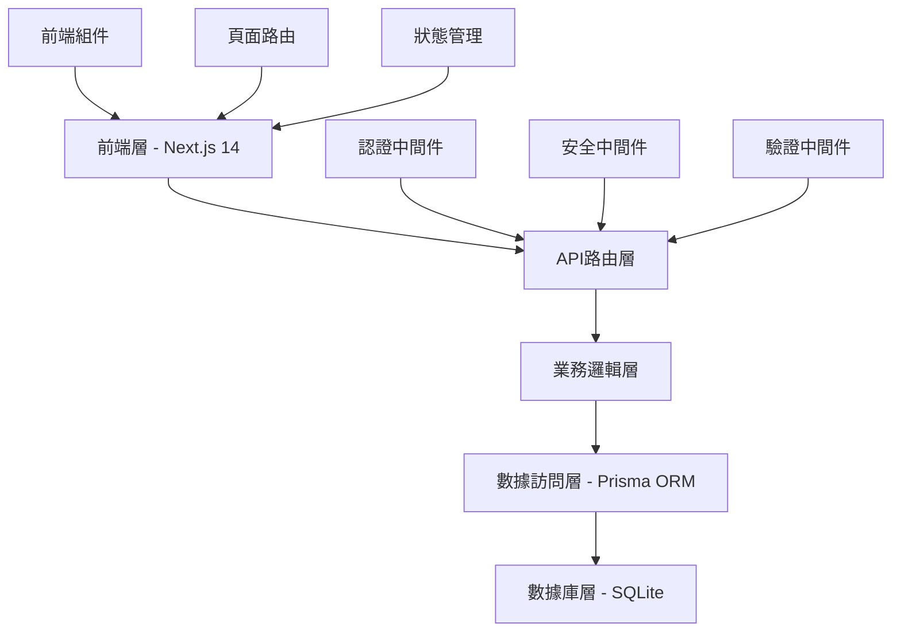
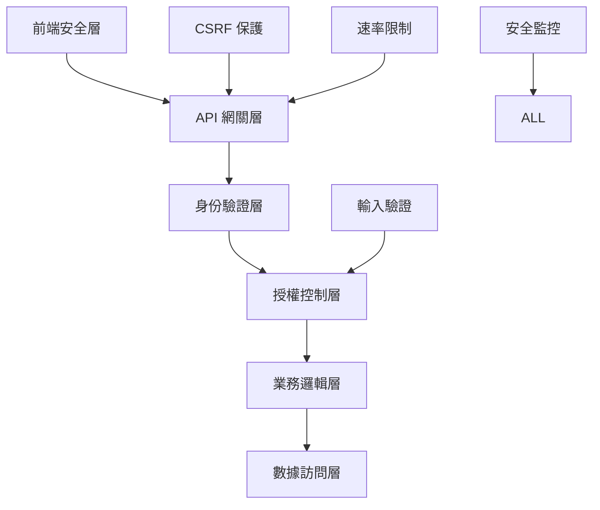
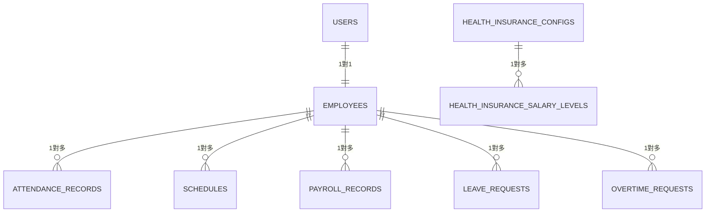
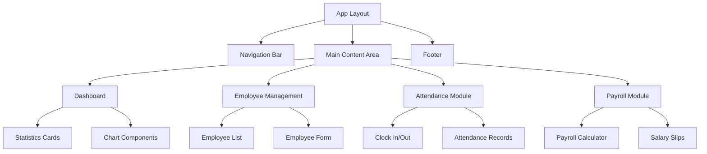

# 長富考勤系統 - 完整技術管理文件總覽

## 文檔概述

本文檔為長富考勤系統（Changfu Attendance System）的完整技術管理文件總覽，涵蓋專案架構、開發規範、部署指南、維護手冊以及所有相關技術文檔的索引和說明。

**專案名稱**: 長富考勤系統  
**技術棧**: Next.js 14, TypeScript, Prisma ORM, SQLite  
**開發團隊**: 系統開發團隊  
**文檔版本**: 3.0  
**最後更新**: 2025年9月4日  

---

## 🏗️ 專案架構總覽

### 技術棧架構



### 核心功能模組

1. **考勤管理系統**
   - 員工打卡記錄
   - 排班管理
   - 請假申請
   - 加班申請

2. **薪資管理系統**
   - 薪資條生成
   - 健保費計算
   - 所得稅計算
   - 勞保費計算

3. **人事管理系統**
   - 員工資料管理
   - 部門管理
   - 權限控制
   - 公告系統

4. **報表統計系統**
   - 考勤統計
   - 薪資統計
   - 人事報表
   - 安全監控

---

## 📚 技術文檔索引

### 核心系統文檔

#### 1. 安全與風險管理文檔

**🔒 COMPREHENSIVE_SECURITY_RISK_ASSESSMENT.md**
- **用途**: 完整的安全風險評估和防護措施
- **內容**: 
  - 系統安全架構設計
  - API 速率限制防護
  - 輸入驗證和數據完整性
  - CSRF 保護機制
  - 安全監控和入侵檢測
  - 風險等級評估和緩解策略
- **維護週期**: 每季度更新
- **責任人員**: 安全工程師

#### 2. 薪資系統文檔

**💰 PAYROLL_STRUCTURE_DATABASE_GUIDE.md**
- **用途**: 薪資條結構設計和數據庫實施方案
- **內容**:
  - 完整薪資結構定義
  - 健保費計算邏輯
  - 勞保費和所得稅計算
  - 數據庫設計規範
  - API 端點設計
  - 權限控制矩陣
- **維護週期**: 每季度更新
- **責任人員**: 薪資系統開發工程師

**🏥 HEALTH_INSURANCE_FORMULA_VARIABLES_GUIDE.md**
- **用途**: 健保費計算公式和變數配置指南
- **內容**:
  - 台灣健保制度詳細說明
  - 健保費計算公式和參數
  - 投保金額分級表管理
  - 眷屬人數限制規則
  - 補充保費計算邏輯
  - 配置變數管理系統
- **維護週期**: 每月檢查法規更新
- **責任人員**: 薪資計算專員

**👨‍👩‍👧‍👦 EMPLOYEE_DEPENDENTS_MANAGEMENT_GUIDE.md**
- **用途**: 員工健保眷屬人數設定與管理指南
- **內容**:
  - 眷屬定義和資格認定
  - 眷屬管理系統架構
  - 新增/移除眷屬流程
  - 批量眷屬管理機制
  - 自動化驗證和提醒
  - 合規性稽核系統
- **維護週期**: 每季度更新
- **責任人員**: 人事管理專員

#### 3. 考勤與排班文檔

**📅 ATTENDANCE_GUIDE.md**
- **用途**: 考勤系統使用指南
- **內容**:
  - 考勤打卡流程
  - 異常考勤處理
  - 考勤統計報表
  - 管理員操作指南
- **維護週期**: 每半年更新
- **責任人員**: 考勤系統管理員

**⏰ OVERTIME-GUIDE.md**
- **用途**: 加班申請和管理指南
- **內容**:
  - 加班申請流程
  - 加班費計算規則
  - 加班時數統計
  - 審核流程管理
- **維護週期**: 每季度更新
- **責任人員**: 人事管理專員

#### 4. 故障排除文檔

**🐛 DEBUG_500_GUIDE.md**
- **用途**: 系統錯誤診斷和修復指南
- **內容**:
  - 常見 500 錯誤排查
  - 數據庫連接問題
  - API 調用失敗處理
  - 系統監控指標
- **維護週期**: 根據問題頻率更新
- **責任人員**: 系統運維工程師

### 修復和維護文檔

#### 修復報告文檔

**🔧 FIX_REPORT.md**
- **用途**: 系統修復記錄總覽
- **內容**: 所有系統修復的詳細記錄和解決方案

**✅ FIXES_REPORT.md** 
- **用途**: 修復成功案例彙總
- **內容**: 成功修復的問題案例和經驗總結

**📊 fix-success-report.md**
- **用途**: 修復成功率統計報告
- **內容**: 修復效率分析和改進建議

#### API 修復文檔

**🔧 api-fix-manual-guide.md**
- **用途**: API 問題手動修復指南
- **內容**: API 相關問題的診斷和修復步驟

**📋 api-fix-manual-required.html**
- **用途**: API 修復必要步驟清單
- **內容**: HTML 格式的修復檢查清單

---

## 🚀 開發環境設置

### 環境需求

```json
{
  "node": ">=18.0.0",
  "npm": ">=8.0.0",
  "dependencies": {
    "next": "14.x",
    "react": "18.x",
    "typescript": "5.x",
    "prisma": "^5.0.0",
    "@prisma/client": "^5.0.0",
    "zod": "^3.22.0",
    "bcryptjs": "^2.4.3",
    "jsonwebtoken": "^9.0.2"
  }
}
```

### 專案結構

```
changfu-attendance-system/
├── src/
│   ├── app/                    # Next.js App Router
│   │   ├── api/               # API 路由
│   │   ├── attendance/        # 考勤相關頁面
│   │   ├── employees/         # 員工管理頁面
│   │   ├── payroll/          # 薪資管理頁面
│   │   └── ...
│   ├── lib/                   # 核心函式庫
│   │   ├── auth.ts           # 認證邏輯
│   │   ├── database.ts       # 數據庫連接
│   │   ├── tax-calculator.ts # 薪資計算
│   │   ├── rate-limit.ts     # 速率限制
│   │   ├── validation.ts     # 數據驗證
│   │   ├── csrf.ts           # CSRF 保護
│   │   └── security-monitoring.ts # 安全監控
│   └── types/                 # TypeScript 型別定義
├── prisma/                    # 數據庫設計
│   ├── schema.prisma         # 數據庫架構
│   ├── dev.db               # SQLite 數據庫文件
│   └── seed.ts              # 數據庫種子文件
├── data/                      # 配置數據
│   ├── schedules.json        # 排班配置
│   └── weekly-templates.json # 週排班模板
├── uploads/                   # 文件上傳目錄
└── docs/                      # 技術文檔目錄
```

### 快速啟動指南

1. **環境準備**
   ```bash
   # 克隆專案
   git clone [repository-url]
   cd changfu-attendance-system
   
   # 安裝依賴
   npm install
   
   # 配置環境變數
   cp .env.example .env.local
   ```

2. **數據庫設置**
   ```bash
   # 生成 Prisma 客戶端
   npx prisma generate
   
   # 執行數據庫遷移
   npx prisma db push
   
   # 執行種子數據
   npx prisma db seed
   ```

3. **啟動開發服務器**
   ```bash
   # 開發模式
   npm run dev
   
   # 生產構建
   npm run build
   npm start
   ```

---

## 🔒 安全架構設計

### 安全層級架構



### 已實施的安全措施

1. **API 速率限制** (`src/lib/rate-limit.ts`)
   - 基於 IP 和用戶的速率限制
   - 防止 DDoS 攻擊
   - 可配置的限制規則

2. **輸入驗證** (`src/lib/validation.ts`)
   - Zod schema 驗證
   - SQL 注入防護
   - XSS 攻擊防護

3. **CSRF 保護** (`src/lib/csrf.ts`)
   - Token 基礎的 CSRF 防護
   - 自動 token 更新機制
   - 跨站請求偽造防護

4. **安全監控** (`src/lib/security-monitoring.ts`)
   - 即時威脅檢測
   - 異常行為監控
   - 安全事件記錄

---

## 💾 數據庫設計架構

### 核心數據表

#### 用戶和員工管理
```sql
-- 用戶表 (系統登入用)
users
├── id (主鍵)
├── username (用戶名)
├── email (電子郵件)
├── password_hash (密碼雜湊)
├── role (角色權限)
└── created_at (建立時間)

-- 員工表 (人事資料)
employees
├── id (主鍵)
├── employee_id (員工編號)
├── name (姓名)
├── base_salary (基本薪資)
├── dependents_count (眷屬人數)
├── department (部門)
└── hire_date (到職日期)
```

#### 考勤管理
```sql
-- 考勤記錄表
attendance_records
├── id (主鍵)
├── employee_id (員工ID)
├── work_date (工作日期)
├── clock_in_time (上班打卡)
├── clock_out_time (下班打卡)
├── regular_hours (正常工時)
└── overtime_hours (加班時數)

-- 排班管理表
schedules
├── id (主鍵)
├── employee_id (員工ID)
├── date (排班日期)
├── shift_type (班別類型)
└── work_hours (工作時數)
```

#### 薪資管理
```sql
-- 薪資記錄表
payroll_records
├── id (主鍵)
├── employee_id (員工ID)
├── pay_year (薪資年度)
├── pay_month (薪資月份)
├── gross_pay (薪資總額)
├── health_insurance (健保費)
├── net_pay (實領薪資)
└── health_insurance_details (健保計算詳情)

-- 健保配置表
health_insurance_configs
├── id (主鍵)
├── premium_rate (保險費率)
├── employee_contribution_ratio (員工負擔比例)
├── max_dependents (最大眷屬人數)
└── effective_date (生效日期)
```

### 數據關聯圖



---

## 🔧 API 設計規範

### RESTful API 架構

#### 認證與授權 API
```typescript
POST   /api/auth/login          // 用戶登入
POST   /api/auth/logout         // 用戶登出
POST   /api/auth/refresh        // 刷新 Token
GET    /api/auth/profile        // 取得用戶資料
```

#### 員工管理 API
```typescript
GET    /api/employees           // 取得員工列表
GET    /api/employees/:id       // 取得特定員工
POST   /api/employees           // 新增員工
PUT    /api/employees/:id       // 更新員工資料
DELETE /api/employees/:id       // 刪除員工
PUT    /api/employees/:id/dependents // 更新眷屬人數
```

#### 考勤管理 API
```typescript
GET    /api/attendance          // 取得考勤記錄
POST   /api/attendance/clock-in // 上班打卡
POST   /api/attendance/clock-out // 下班打卡
GET    /api/attendance/reports  // 考勤報表
```

#### 薪資管理 API
```typescript
GET    /api/payroll             // 取得薪資記錄
POST   /api/payroll/calculate   // 計算薪資
GET    /api/payroll/slips/:id   // 取得薪資條
PUT    /api/payroll/health-insurance/config // 更新健保配置
```

#### 安全相關 API
```typescript
GET    /api/csrf-token          // 取得 CSRF Token
GET    /api/security/status     // 安全狀態監控
POST   /api/security/report     // 安全事件回報
```

### API 安全規範

1. **認證機制**
   - JWT Token 認證
   - Token 過期機制
   - 刷新 Token 流程

2. **授權控制**
   - 角色基礎存取控制 (RBAC)
   - 細粒度權限管理
   - API 路由保護

3. **數據驗證**
   - 請求參數驗證
   - 回應數據過濾
   - 錯誤處理機制

---

## 🎨 前端架構設計

### 組件架構



### 技術棧

1. **前端框架**: Next.js 14 (App Router)
2. **UI 框架**: React 18 + TypeScript
3. **樣式系統**: Tailwind CSS
4. **狀態管理**: React Hooks + Context API
5. **表單處理**: React Hook Form + Zod 驗證
6. **數據獲取**: Next.js API Routes + Fetch

### 頁面路由結構

```
/                           # 首頁 (重定向到 dashboard)
/login                      # 登入頁面
/dashboard                  # 儀表板
/employees                  # 員工管理
  /employees/[id]          # 員工詳細資料
  /employees/new           # 新增員工
/attendance                 # 考勤管理
  /attendance/records      # 考勤記錄
  /attendance/reports      # 考勤報表
/payroll                   # 薪資管理
  /payroll/calculate       # 薪資計算
  /payroll/slips          # 薪資條
/schedule-management       # 排班管理
/reports                   # 報表系統
/announcements            # 公告系統
```

---

## 🔐 權限管理系統

### 角色定義

#### 1. EMPLOYEE (一般員工)
```typescript
permissions: {
  attendance: ['read_own', 'clock_in', 'clock_out'],
  payroll: ['read_own'],
  profile: ['read_own', 'update_basic'],
  leave: ['create', 'read_own'],
  overtime: ['create', 'read_own']
}
```

#### 2. HR (人事專員)
```typescript
permissions: {
  employees: ['read', 'create', 'update'],
  attendance: ['read_all', 'manage_records'],
  payroll: ['read_all', 'calculate'],
  leave: ['read_all', 'approve'],
  overtime: ['read_all', 'approve'],
  reports: ['generate', 'export'],
  announcements: ['create', 'update', 'delete']
}
```

#### 3. ADMIN (系統管理員)
```typescript
permissions: {
  all: ['*'], // 完整權限
  system: ['config', 'security', 'backup'],
  users: ['create', 'update', 'delete', 'assign_roles'],
  health_insurance: ['configure', 'update_rates'],
  security: ['monitor', 'review_logs']
}
```

### 權限檢查中間件

```typescript
// 權限檢查範例
export function requirePermission(permission: string) {
  return async (req: NextRequest) => {
    const user = await getCurrentUser(req);
    if (!user || !hasPermission(user, permission)) {
      return new Response('Forbidden', { status: 403 });
    }
  };
}
```

---

## 📊 監控與日誌系統

### 系統監控指標

#### 1. 性能指標
- API 回應時間
- 數據庫查詢性能
- 頁面載入速度
- 記憶體使用率

#### 2. 業務指標
- 用戶活躍度
- 功能使用頻率
- 錯誤發生率
- 系統可用性

#### 3. 安全指標
- 登入失敗次數
- 異常 API 調用
- 權限違規嘗試
- 安全事件頻率

### 日誌分類

#### 1. 系統日誌
```typescript
interface SystemLog {
  level: 'info' | 'warn' | 'error';
  timestamp: Date;
  component: string;
  message: string;
  metadata?: any;
}
```

#### 2. 安全日誌
```typescript
interface SecurityLog {
  event_type: 'login' | 'permission_violation' | 'rate_limit';
  user_id?: number;
  ip_address: string;
  user_agent: string;
  timestamp: Date;
  details: any;
}
```

#### 3. 業務日誌
```typescript
interface BusinessLog {
  action: 'payroll_calculate' | 'employee_update' | 'attendance_record';
  employee_id: number;
  operator_id: number;
  timestamp: Date;
  input_data: any;
  result: any;
}
```

---

## 🚀 部署與維運指南

### 部署環境

#### 開發環境 (Development)
```yaml
環境: Local Development
數據庫: SQLite (開發用)
端口: 3000
日誌級別: debug
安全設定: 寬鬆 (僅供開發)
```

#### 測試環境 (Staging)
```yaml
環境: Staging Server
數據庫: SQLite/PostgreSQL
端口: 8080
日誌級別: info
安全設定: 生產級別
```

#### 生產環境 (Production)
```yaml
環境: Production Server
數據庫: PostgreSQL (推薦)
端口: 80/443
日誌級別: warn
安全設定: 最高級別
```

### 部署檢查清單

#### 部署前檢查
- [ ] 所有測試通過
- [ ] 安全掃描完成
- [ ] 性能測試通過
- [ ] 數據庫備份完成
- [ ] 環境變數配置正確
- [ ] SSL 憑證有效

#### 部署後驗證
- [ ] 應用程式正常啟動
- [ ] 數據庫連接正常
- [ ] API 端點正常回應
- [ ] 登入功能正常
- [ ] 薪資計算功能正常
- [ ] 監控系統正常運作

### 備份策略

#### 數據備份
```bash
# 每日自動備份（正式環境使用 /home/deploy/backup-database.sh，repo 來源為 scripts/backup-database.sh）
0 19 * * * /home/deploy/backup-database.sh

# 每週完整備份
0 1 * * 0 /scripts/full-backup.sh

# 每月歸檔備份
0 0 1 * * /scripts/archive-backup.sh
```

#### 配置備份
- 環境變數配置
- 數據庫 schema
- 應用程式配置
- SSL 憑證

---

## 🔧 維護與更新指南

### 定期維護任務

#### 每日任務
- [ ] 檢查系統日誌
- [ ] 監控性能指標
- [ ] 驗證備份完成
- [ ] 檢查安全警告

#### 每週任務
- [ ] 審查用戶活動
- [ ] 檢查數據完整性
- [ ] 更新安全規則
- [ ] 清理臨時文件

#### 每月任務
- [ ] 更新依賴套件
- [ ] 檢查法規更新
- [ ] 審查權限設定
- [ ] 性能優化評估

#### 每季任務
- [ ] 全面安全審計
- [ ] 系統性能評估
- [ ] 用戶滿意度調查
- [ ] 災難恢復測試

### 更新流程

#### 1. 計劃階段
- 評估更新需求
- 制定更新計劃
- 準備測試環境
- 通知相關人員

#### 2. 測試階段
- 部署到測試環境
- 執行功能測試
- 執行性能測試
- 執行安全測試

#### 3. 部署階段
- 備份現有系統
- 部署新版本
- 驗證部署結果
- 回滾計劃準備

#### 4. 監控階段
- 監控系統穩定性
- 收集用戶反饋
- 處理緊急問題
- 文檔更新

---

## 📋 故障排除指南

### 常見問題診斷

#### 1. 系統無法啟動
```bash
# 檢查 Node.js 版本
node --version

# 檢查依賴安裝
npm list --depth=0

# 檢查環境變數
printenv | grep NEXT

# 檢查端口占用
netstat -tulpn | grep :3000
```

#### 2. 數據庫連接失敗
```bash
# 檢查數據庫文件
ls -la prisma/dev.db

# 檢查 Prisma 配置
npx prisma generate
npx prisma db push

# 測試數據庫連接
npx prisma studio
```

#### 3. API 回應緩慢
```bash
# 檢查系統資源
top
free -h
df -h

# 檢查網路連接
netstat -i
ss -tuln
```

#### 4. 登入問題
- 檢查 JWT 密鑰配置
- 驗證用戶密碼雜湊
- 檢查 session 設定
- 審查認證中間件

### 緊急處理程序

#### 1. 系統當機
1. 立即通知相關人員
2. 嘗試系統重啟
3. 檢查錯誤日誌
4. 切換到備援系統
5. 分析根本原因

#### 2. 數據異常
1. 停止相關功能
2. 備份當前數據
3. 分析數據問題
4. 從備份恢復
5. 驗證數據完整性

#### 3. 安全事件
1. 隔離受影響系統
2. 收集事件證據
3. 通知安全團隊
4. 執行應急響應
5. 事後分析改進

---

## 📈 性能優化建議

### 前端性能優化

1. **程式碼分割**
   - 路由級別的程式碼分割
   - 組件懶載入
   - 動態 import

2. **資源優化**
   - 圖片壓縮和 WebP 格式
   - CSS 和 JS 壓縮
   - CDN 加速

3. **渲染優化**
   - React.memo 和 useMemo
   - 虛擬滾動
   - 服務端渲染 (SSR)

### 後端性能優化

1. **數據庫優化**
   - 索引優化
   - 查詢優化
   - 連接池管理

2. **API 優化**
   - 回應壓縮
   - 緩存策略
   - 批量操作

3. **系統優化**
   - 記憶體管理
   - 垃圾回收調優
   - 非同步處理

---

## 🔒 安全最佳實踐

### 開發安全

1. **程式碼安全**
   - 靜態程式碼分析
   - 依賴漏洞掃描
   - 安全程式碼審查

2. **數據安全**
   - 敏感數據加密
   - 密碼安全存儲
   - 個人資料保護

3. **通信安全**
   - HTTPS 強制使用
   - API 認證授權
   - 跨域請求控制

### 運維安全

1. **系統加固**
   - 作業系統更新
   - 服務配置加固
   - 網路安全設定

2. **監控警報**
   - 入侵檢測系統
   - 異常行為監控
   - 安全事件警報

3. **存取控制**
   - 最小權限原則
   - 多因素認證
   - 定期權限審查

---

## 📞 技術支援與聯絡資訊

### 支援團隊

#### 開發團隊
- **負責人**: 系統開發工程師
- **聯絡方式**: dev-team@changfu.com
- **支援時間**: 週一至週五 09:00-18:00

#### 運維團隊  
- **負責人**: 系統運維工程師
- **聯絡方式**: ops-team@changfu.com
- **支援時間**: 24/7 (緊急事件)

#### 安全團隊
- **負責人**: 安全工程師
- **聯絡方式**: security-team@changfu.com
- **支援時間**: 24/7 (安全事件)

### 緊急聯絡程序

1. **系統緊急故障**
   - 立即聯絡運維團隊
   - 同時通知開發團隊
   - 記錄故障詳情

2. **安全事件**
   - 立即聯絡安全團隊
   - 保護現場證據
   - 執行應急響應

3. **數據問題**
   - 聯絡數據管理員
   - 停止相關操作
   - 準備恢復計劃

---

## 📝 文檔維護與更新

### 文檔管理流程

1. **文檔建立**
   - 確定文檔需求
   - 分配編寫責任
   - 設定完成時間

2. **文檔審核**
   - 技術內容審核
   - 格式規範檢查
   - 實用性評估

3. **文檔發布**
   - 版本控制管理
   - 發布通知
   - 存取權限設定

4. **文檔維護**
   - 定期內容更新
   - 反饋收集處理
   - 廢棄文檔清理

### 版本控制規範

```
版本格式: Major.Minor.Patch
例如: 3.1.2

Major: 重大架構變更
Minor: 功能新增或修改
Patch: 錯誤修正或小幅改進
```

### 文檔更新排程

| 文檔類型 | 更新頻率 | 負責人員 |
|---------|---------|---------|
| 安全文檔 | 每季 | 安全工程師 |
| 系統架構 | 每半年 | 系統架構師 |
| API 文檔 | 每次發布 | 開發工程師 |
| 用戶指南 | 每月 | 產品經理 |
| 維運手冊 | 每季 | 運維工程師 |

---

## 🎯 未來發展規劃

### 短期目標 (3個月)

1. **功能擴展**
   - 行動裝置應用開發
   - 報表系統增強
   - 自動化測試覆蓋

2. **性能提升**
   - 數據庫查詢優化
   - 前端載入速度改善
   - API 回應時間優化

3. **安全強化**
   - 雙因素認證實施
   - 安全審計自動化
   - 威脅檢測增強

### 中期目標 (6-12個月)

1. **技術升級**
   - 微服務架構遷移
   - 容器化部署
   - 雲端服務整合

2. **功能創新**
   - AI 輔助排班
   - 智能異常檢測
   - 預測性分析

3. **擴展整合**
   - 第三方系統整合
   - 開放 API 平台
   - 多租戶支援

### 長期願景 (1-3年)

1. **平台化發展**
   - SaaS 服務模式
   - 插件生態系統
   - 國際化支援

2. **智能化轉型**
   - 機器學習整合
   - 自動化決策支援
   - 智能客服系統

3. **生態建設**
   - 開發者社群
   - 技術標準制定
   - 行業解決方案

---

## 📚 參考資料與延伸閱讀

### 技術文檔
- [Next.js 官方文檔](https://nextjs.org/docs)
- [Prisma ORM 指南](https://www.prisma.io/docs)
- [TypeScript 手冊](https://www.typescriptlang.org/docs)
- [React 官方文檔](https://react.dev)

### 安全標準
- [OWASP Top 10](https://owasp.org/www-project-top-ten/)
- [NIST 網路安全框架](https://www.nist.gov/cyberframework)
- [ISO 27001 標準](https://www.iso.org/isoiec-27001-information-security.html)

### 法規參考
- [台灣勞動基準法](https://law.moj.gov.tw/LawClass/LawAll.aspx?pcode=N0030001)
- [全民健康保險法](https://law.moj.gov.tw/LawClass/LawAll.aspx?pcode=L0060001)
- [個人資料保護法](https://law.moj.gov.tw/LawClass/LawAll.aspx?pcode=I0050021)

### 最佳實踐
- [12-Factor App 方法論](https://12factor.net/)
- [React 最佳實踐](https://react.dev/learn/thinking-in-react)
- [Node.js 安全最佳實踐](https://nodejs.org/en/docs/guides/security/)

---

*本文檔為長富考勤系統的完整技術管理文件總覽，涵蓋了系統開發、部署、維護的各個面向。請定期檢查更新，確保文檔內容與系統實際狀態保持一致。*

**文檔維護責任**:
- **主要維護者**: 系統開發團隊
- **技術審核者**: 系統架構師  
- **內容審核者**: 專案經理
- **最終核准者**: 技術總監

**版本歷史**:
- v1.0 (2025-01-01): 初始版本建立
- v2.0 (2025-06-01): 安全架構更新
- v3.0 (2025-09-04): 完整技術管理文件整合

**下次審核時間**: 2025年12月4日
